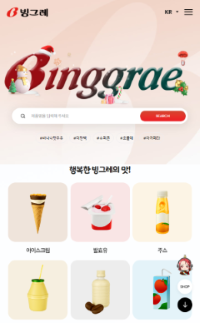

# binggrae

빙그레 클론코딩 (메인페이지와 제품소개 페이지만)

__[원본 사이트](https://www.bing.co.kr/)__

## 개선 사항

### 1. main과 section 사이의 간격

좌: 원본 사이트 / 우: 클론 사이트

#### 배경 설명

빙그레의 원본 사이트를 모바일 사이즈로 확인했을 때, 메인 영역과 섹션 영역 간의 간격이 지나치게 좁아 사용자에게 각 영역 간의 구분이 명확하게 전달되지 않는 문제가 있습니다. 

또한, 메인 영역의 배경 이미지와 흰 바탕의 경계가 너무 도드라져 어색한 시각적 효과를 유발한다고 생각됩니다.

 

#### 개선 목적

웹 페이지의 시각적 구조와 배경 요소를 개선

1. 각 영역 간 구분을 명확히 하여 정보 전달력을 높임
2. 배경 이미지와 흰 바탕의 연결을 자연스럽게 만들어 사용자 경험을 향상시킴

 

#### 수정 목표

1. 영역 간 간격 조정
  - 메인 영역과 섹션 사이의 간격을 확대하여 각 영역이 명확하게 구분될 수 있도록 디자인 조정
  - 사용자들이 시각적으로 편안하게 콘텐츠를 인지할 수 있음

2. 배경 이미지 경계 처리
  - 메인 영역의 배경 이미지와 흰 바탕의 경계 부분을 부드럽게 연결되도록 수정

 

#### 기대 효과

1. 정보 전달력 향상
  - 영역 간 간격 조정으로 콘텐츠 간의 구분이 명확해져 사용자들이 보다 빠르게 정보를 이해할 수 있음

2. 시각적 만족도 개선
  - 배경 이미지와 흰 바탕이 자연스럽게 연결되어 깔끔한 디자인을 제공

 
 

### 2. 슬라이드

1, 2: 원본 사이트 / 3: 클론 사이트

#### 배경 설명

빙그레 원본 사이트를 모바일 화면으로 봤을 때 슬라이드가 두 줄로 배치되어 화면에 나타납니다. 작은 화면에서는 이러한 구성이 시각적으로 복잡해 보일 수 있다는 생각이 들었습니다.

 

#### 개선 목적

슬라이드 배치를 모바일 환경에 맞게 간소화

1. 시각적 복잡성을 줄임
2. 콘텐츠를 보다 깔끔하고 명확하게 전달

 

#### 수정 목표

1. 슬라이드 구조 조정
  - 모바일 화면상에서는 슬라이드가 한 줄로만 보이도록 수정
  - 한 화면에 나타나는 슬라이드의 개수는 원본 사이트와 동일하게 유지하면서 레이아웃이 단순화 되도록 디자인

 

#### 기대 효과

1. 시각적 단순화
  - 슬라이드가 한 줄로 정리되어 화면 구성이 깔끔해짐
  - 사용자가 콘텐츠를 좀 더 명확하게 인지할 수 있음

2. 탐색 편의성 향상
  - 시각적 복잡성이 줄어들어 슬라이드 탐색이 간편해짐

 
 

### 3. 챗봇 버튼 애니메이션

#### 배경 설명

빙그레 원본 사이트에서는 챗봇 버튼에 애니메이션이 적용되어 있으며 마우스를 올려도 애니메이션이 중단되지 않습니다. 

하지만 사용자가 버튼과 상호작용하는 동안 애니메이션이 계속 작동하면 시각적으로 혼란을 주거나 버튼 클릭에 대한 명확한 피드백이 부족하다고 느낄 수 있습니다.

 

#### 개선 목적

챗봇 버튼에 마우스를 올렸을 때 애니메이션을 일시적으로 중단하도록 변경

1. 사용자 상호작용시 명확한 피드백 제공
2. 직관적은 사용자 경험 구현

 

#### 수정 목표

1. 애니메이션 중단 동작 추가
  - 마우스가 챗봇 버튼 위로 올라갔을 때 애니메이션 중단
  - 마우스가 버튼에서 벗어나면 애니메이션이 다시 재생

2. 사용자 피드백 강화
  - 버튼과의 상호작용이 명확하게 드러나도록 동작을 조정하여 시각적 혼란을 줄임
  - 사용자가 버튼에 마우스를 올렸는지 직관적으로 확인할 수 있도록 개선

 

#### 기대 효과

1. 사용자 상호작용 개선
  - 마우스 오버 시 애니메이션이 중단되어 버튼에 대한 사용자 피드백이 명확해짐

2. 시각적 안정성 제공
  - 상호작용 중 애니메이션의 일시 중단으로 시각적인 혼란이 감소

3. 접근성 향상
  - 버튼에 대한 피드백이 명확해져 사용자 경험이 보다 직관적이고 이해하기 쉬워짐